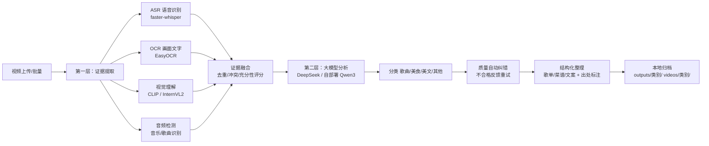

# 🎬 智能短视频分析系统

一个**两层 AI 架构**的短视频自动分析工具：第一层用专业模型（语音识别 / 文字识别 / 视觉理解 / 音频检测）从视频中提取事实证据，第二层调用大语言模型（DeepSeek 等）完成**分类、结构化整理、信息出处标注和质量自动纠错**，并提供 Web 界面、批量分析、AI 问答等功能。

> 典型用途：把你在抖音等平台收藏/点赞的一批短视频，自动分析归类（歌曲 / 美食 / 美文 / 其他），提取出歌单、菜谱、文案摘抄，并沉淀成本地可搜索的知识库。

---

## ✨ 功能特性

| 模块 | 说明 |
|------|------|
| 🔍 第一层取证 | 并行运行 ASR 语音识别（faster-whisper）、OCR 画面文字（EasyOCR）、视觉理解（CLIP / InternVL2 VLM）、音频检测（音乐片段/歌曲识别） |
| 🧠 第二层分析 | 大模型自动分类：歌曲 / 美食 / 美文 / 其他；按类别结构化提取（歌名/歌手、菜名/食材/步骤、原文/作者） |
| 🏷️ 出处标注 | 每条关键信息标注来源：📹 视频 / 🌐 网络推断 / ❓ 未知，杜绝大模型编造 |
| ✅ 质量自动纠错 | 质检器逐项校验输出，不合格自动反馈给大模型重试，仍不过则降级为 unknown；网页展示完整纠错路径 |
| 🌐 Web 界面 | 上传/拖拽、批量上传（并行分析）、模型选择、视频播放、分析详情、人工纠错、导出 MD/JSON |
| ⚙️ 高级参数 | 抽帧间隔、LLM 温度、质检重试、ASR 规格/束宽/线程、VLM 帧数、OCR 压缩、并行任务数，全部带 ❓ 解释 |
| 📌 推荐搭配 | 一键预设：⚡极速 / ⚖️均衡 / 🎯高质量，且**自动检测本机配置**（CPU 核数/内存/GPU）自适应 |
| 📊 历史记录 | 按类别分组、彩色标签页、本地自动归档到 `outputs/<类别>/` 和 `videos/<类别>/` |
| ✨ AI 总结 | 每个类别一键生成大模型总结报告（内联展示，含进度动画） |
| 💬 AI 问答 | 微信式聊天框，选定内容范围后提问，基于你的收藏库回答 |
| 🔌 可扩展 | 提取器注册表 + 整理器注册表，新增模型/类别只需注册即可，Web 选项自动出现 |
| 💾 断点恢复 | 任务状态持久化，服务重启后未完成任务自动继续分析 |

---

## 🏗️ 系统架构



---

## 📁 目录结构

```
智能项目/
├── web_ui.py              # 启动入口（python web_ui.py）
├── run_pipeline.py        # 命令行一键分析
├── backend/               # Web 后端（标准库 HTTP API，无框架依赖）
├── frontend/              # 单文件前端 index.html（fetch 调用 API）
├── first_layer/           # 第一层：媒体预处理 + 四类专业模型 + 提取器注册表
├── second_layer/          # 第二层：证据融合 + LLM 分析 + 质检 + 整理器注册表
├── models/                # 本地模型目录（约 6GB，见下文下载）
├── videos/                # 上传的视频（按类别自动归档）
├── outputs/               # 分析结果 JSON/MD（按类别自动归档）
├── requirements.txt       # Python 依赖
└── .env                   # 私密配置（API Key，不上传 GitHub）
```

---

## 🚀 快速开始

### 1. 环境要求

- Python **3.10 ~ 3.13**（推荐 3.11/3.12；Windows/Linux 均可）
- 内存 ≥ 8GB（批量并行建议 16GB+），磁盘预留 **约 10GB**（依赖 + 模型约 6GB）
- 显卡可选：CPU 可跑通全部流程；有 NVIDIA GPU 可获得数倍加速
- 国内网络请使用 PyPI 镜像安装（见下）

### 2. 安装依赖

```bash
# 建议使用虚拟环境
python -m venv venv
# Windows: venv\Scripts\activate   Linux/macOS: source venv/bin/activate

# 安装（国内任选一个镜像加速）
pip install -r requirements.txt -i https://mirrors.aliyun.com/pypi/simple/
# 或
pip install -r requirements.txt -i https://pypi.tuna.tsinghua.edu.cn/simple
```

> **CPU 版 PyTorch 更小更快**（Windows）：先单独安装
> `pip install torch --index-url https://download.pytorch.org/whl/cpu`，再装 requirements.txt。

### 3. 配置大模型密钥

在项目根目录新建 `.env` 文件（此文件已被 .gitignore 排除，不会上传）：

```ini
# 第二层大模型（DeepSeek 云端，必填其一）
LLM_API_KEY=sk-你的密钥
# 可选：自定义接口与模型
# LLM_BASE_URL=https://api.deepseek.com
# LLM_MODEL=deepseek-chat

# 可选：使用自部署 Qwen3（老师 HPC 模式，走 SSH 隧道 + Bearer 令牌）
# HPC_QWEN_URL=http://127.0.0.1:8000
# HPC_QWEN_TOKEN=本次作业令牌
```

> DeepSeek 密钥申请：https://platform.deepseek.com → API Keys。
> 没有密钥时，第一层证据提取仍可运行（`--evidence-only`），第二层大模型功能不可用。

### 4. 准备模型文件（约 6GB）

GitHub 仓库**不包含模型文件**，请先下载到 `models/` 目录（与 `models/说明.md` 一致的结构）：

| 模型 | 用途 | 大小 | 下载方式 |
|------|------|------|---------|
| faster-whisper tiny/base/small/medium | 语音识别 | 各 75MB~1.5GB | ① ② |
| EasyOCR（craft_mlt_25k + zh_sim_g2） | 画面文字 | ~110MB | ③ |
| CLIP ViT-B/32 | 视觉理解（轻量） | ~338MB | ① |
| InternVL2-2B（可选） | 视觉理解（高质量 VLM） | ~4.2GB | ① ④ |

**下载方式：**

- **① 自动下载**：首次运行会自动从 HuggingFace 拉取（国内先设置镜像）：
  ```bash
  # Windows PowerShell
  $env:HF_ENDPOINT = "https://hf-mirror.com"
  $env:HF_HUB_DISABLE_XET = "1"
  ```
- **② ASR 小模型**（tiny/base/small，加速用）建议直接从镜像下载到项目目录：
  ```bash
  mkdir -p models/faster-whisper-tiny models/faster-whisper-base models/faster-whisper-small
  # 每个目录下载 4 个文件（以 tiny 为例）：
  # https://hf-mirror.com/Systran/faster-whisper-tiny/resolve/main/{model.bin,config.json,tokenizer.json,vocabulary.txt}
  ```
- **③ EasyOCR**：把 `craft_mlt_25k.pth`、`zh_sim_g2.pth` 放入 `models/easyocr/`。
- **④ InternVL2-2B**（可选）：`git clone https://hf-mirror.com/OpenGVLab/InternVL2-2B models/InternVL2-2B`。

> 完整模型清单见仓库内 `models/说明.md`。

### 5. 启动

```bash
# Web 界面（默认端口 8800）
python web_ui.py --port 8800

# 指定默认并行分析任务数（网页高级参数里也可随时调 1~8）
python web_ui.py --port 8800 --jobs 2
```

浏览器打开 **http://127.0.0.1:8800**。

---

## 🌐 Web 界面使用指南

### 上传并分析

1. **单视频 / 批量上传**：右上角切换模式。批量模式可一次选择/拖拽多个视频（支持移除个别文件），自动按顺序入队并**并行分析**（并发数可调）。
2. **选择参与分析的模型**：勾选 ASR / OCR / 视觉理解 / 音频识别；每个模型可下拉选择后端（如视觉的 clip / vlm）。
3. **⚙️ 高级参数**：
   - 📌 推荐搭配：⚡极速（批量大量视频）/ ⚖️均衡（日常）/ 🎯高质量（正式分析，自动切 VLM）；
   - 页面会自动检测本机配置（CPU 核数/内存/GPU），线程数与并行任务数随之推荐；
   - 每个参数旁的 ❓ 可查看解释。
4. 点「🚀 开始分析」，实时查看每个文件的进度（排队 → 分析中 → ✅完成含类别），完成后自动归档。

### 历史记录

- 按 **歌曲 / 美食 / 美文 / 其他** 分组，顶部标签页可筛选；
- 每条记录可「查看」完整详情：证据、分类理由、质检纠错路径、结构化整理（含出处标注）、人工纠错表单；
- 可导出该视频的 **MD 报告** 和 **JSON**。

### AI 总结 & AI 问答

- **✨ AI 总结**：历史记录每个类别标题旁的按钮，把该类全部视频信息交给大模型，生成「概况 / 关键清单 / 偏好分析 / 建议」报告，内联展示；
- **💬 AI 问答**：先选内容范围（全部/歌曲/美食/美文/其他），再像微信一样提问，例如"我收藏的美食里哪个最值得学做？"，AI 基于你的收藏库回答。

### 本地文件归档

分析完成后自动归档：

```
outputs/歌曲/xxx_evidence.json / _evidence_analysis.json / _evidence_analysis.md
videos/歌曲/xxx.mp4
```

所有文件按类别分文件夹，可直接当本地资料库使用。

---

## ⌨️ 命令行用法

```bash
# 完整分析（第一层 + 第二层）
python run_pipeline.py --input videos/视频.mp4 --no-hf-mirror --no-ocr-download

# 只跑第一层证据提取（不需要 API Key）
python run_pipeline.py --input videos/视频.mp4 --evidence-only

# 常用参数
--keyframe-interval 2.0   # 抽帧间隔（秒）
--asr-model medium        # tiny/base/small/medium（小模型更快）
--asr-beam 1              # 束宽 1 最快 / 5 最准
--asr-threads 8           # ASR CPU 线程
--vlm-max-frames 12       # 视觉最大帧数
--ocr-max-side 1280       # OCR 帧压缩最长边
--visual-backend clip     # clip / vlm
--audio-backend fingerprint  # fingerprint / shazamio / dejavu
--disable-model ocr,audio # 关闭指定模型
--max-duration-minutes 10 # 时长上限
--llm-backend openai      # openai / hpc_qwen
--temperature 0.0         # LLM 温度
--max-retries 2           # 质检重试次数
```

运行 `python run_pipeline.py --help` 查看全部参数。

---

## 🛠️ 二次开发（扩展点）

- **新增第一层模型**：在 `first_layer/pipeline.py` 用 `register_extractor(ExtractorSpec(...))` 注册即可——管线自动并行调度、命令行 `--disable-model` 与网页选项自动生效；
- **新增类别**：在 `second_layer/organizers.py` 定义结果 Schema 并 `register_organizer()`，同时在分类提示词中补充该类定义；
- **换 LLM 后端**：`second_layer/llm_analyzer.py` 的 `call_llm` 是统一分派点，已内置 OpenAI 兼容接口与自部署 Qwen3 两种后端。

---

## ❓ 常见问题（FAQ）

| 问题 | 解决 |
|------|------|
| 端口被占用（Address already in use） | 换端口 `--port 8801`，或结束占用进程 |
| 模型下载慢/失败 | 设置 `HF_ENDPOINT=https://hf-mirror.com`、`HF_HUB_DISABLE_XET=1` |
| 上传的视频网页播放黑屏 | HEVC 编码浏览器不支持；系统已自动转码 H.264，稍等即可 |
| 无声视频 ASR 无结果 | 没有音轨的视频会跳过 ASR/音频检测（属预期） |
| 批量时内存不足 | 关闭「多线程并行分析」，或减小 ASR 规格（tiny/small）、调大抽帧间隔 |
| VLM 模式很慢 | CPU 上 InternVL2 较慢：减小 VLM 最大帧数、增大抽帧间隔，或改用 clip |
| 任务中途服务重启 | 无需担心，重启服务后未完成任务自动恢复继续分析 |
| 中文路径报错 | 程序已内置处理（tokenizer 自动复制到临时 ASCII 目录）；如仍异常请将项目移到纯英文路径 |

---

## 📄 许可证与说明

- 本项目仅用于学习与研究，请勿用于任何违法用途；
- 上传的视频与生成的分析结果均保存在本地（`videos/`、`outputs/`），不会上传到任何第三方服务器（除你配置的大模型 API）；
- 模型版权归各自原作者所有，请遵守对应模型的许可证。
